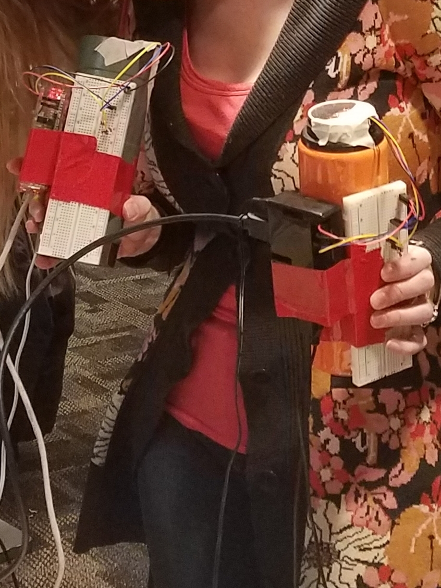

# iotsocialfitness

# Table of contents
1. [DISH IoT Hackathon Rules](#iotrules)
2. [Social Fitness Motivation](#socialfitness)
3. [Installation](#installation)
4. [Future Direction](#futuredirection)

## DISH IoT Hackathon Rules 

In February 2018, Dish Network hosted a two-day IoT Hackathon for 10 teams at their
Meridian campus headquarters in Englewood, CO; the goal was to inspire Dish employees
and outside entrepreneurs, engineers, and data scientists to create and execute
an IoT product that would answer the question, "How can we make Meridian better
using IoT?"  Judged by a panel of executives, the teams would be competing for a
chance to obtain executive sponsorship for their product.  The specific goal for
each team was to "come up with a working demo of a thing that senses or acts(or
  both) in the physical world, controlled via the internet, using Alexa to make
  Meridian better."  The resources given to each team were:
  * Raspberry Pi 3
  * MicroSD Card
  * Pi Wedge
  * Sparkfun Inventor's Kit (photocell, motor, servo, resistors, jumper wires, LEDs,
    buttons)
  * Resistor
  * Breadboard
  * Echo Dot
  * Access to AWS back-end platform
  * $100 Visa gift card

  Each team was given a rubric that the judges would be using to judge us on, specifically
  in the categories of:
  * Feasability
  * Innovation
  * Utility
  * Presentation

## Social Fitness Motivation 

"We live in the most technologically connected age in the history of civilization,
yet rates of loneliness have doubled since the 1980s."
                                                -Vivek Murthy, US Surgeon General

"An employee's work loneliness triggers emotional withdrawal from their organization."
                                                -INC, November 2017

"67% of US workers are NOT engaged at work.  Low-engagement companies have 41% higher
absenteeism, 59% higher turnover, 40% more defects, and 21% lower profitability."
                                                -2017 Gallup State of the American Workforce

Considering this research and the fact that DISH's executives created a 2018 KPI
to focus on workplace engagement, our team chose to create an IoT product that would
facilitate physical human conversations that connect people and create social capital.
But how do you do this using sensors, a Raspberry Pi, and an Alexa?  

## Social Fitness Installation 

If we were going to facilitate social interactions, when and how would we do that?
Realizing that employees most naturally take breaks from their work to go to the
bathroom or refill their coffee cup, we chose to program sensors that would measure
employees' coffee cups; when an employee's coffee cup was empty, Alexa would tell
him/her to go meet another employee, whose coffee cup was also flagged as empty,
at a specific location to refill their coffee and socialize with each other.  In
order to do this, we created two prototype coffee cups that each had a Raspberry
Pi and ultrasonic sensor attached at the top.

The Raspberry Pis were programmed using Python to measure the distance from the ultrasonic sensor
to the surface of the liquid, or bottom of the cup if it was empty.  If the cup
was determined to be empty, an API url with the cup's status, owner, and location would
be sent to our Mongo database.  Since DISH uses hipchat, a web service for internal
private online chat and instant messaging, we programmed hipchat to retrieve the
API from our Mongo database; hipchat would then send a message to the employee
with an empty coffee cup to "get social."  The employee would then tell
Alexa, "Alexa, make me social."  She would then tell the owner of the coffee cup
where to meet another employee whose coffee cup was also empty and what to talk
about.  To determine what the employees should talk about, the data on each employee's
www.flixpert.com account was taken, and the movie most recently rated by either
of the employees was chosen as the subject of conversation.  Once the coffee cup
was filled up, a url would be sent to our Mongo database and hipchat would receive
the API to be alerted to stop sending messages to the employee to get social.

## Future Direction 

Since this was only a hackathon, we have a lot of work to do before putting our
product into production.  Raspberry Pis are not expensive, but you can't just slap
one on a coffee cup and expect employees to want to use it; the design would need
to be less bulky and more durable.  SocialFitness would be an app that each employee
would need to sign onto, since we don't want to bug someone while they are in a
meeting or extremely busy.  Also, in order to better streamline our process, it
would be best if Alexa could tell the employees when and where to fill up their cup,
instead of having to be asked first.  We believe that Alexa will soon have these
type of skills as the Alexa product advances in the next year.  

The 2017 Gallup State of the American Workplace report stated, "High-engagement
companies have 41% lower absenteeism, 59% lower turnover, 40% fewer defects, and
21% higher profitability."  While we don't currently have a model for how we would
create revenue, we are sure that our product would create relationships at work
which would result in higher engagement; with higher engagement, our retention rate
would rise and we could spend less on recruiting.  We are excited to put more work
into this project as we believe it will be a great asset to DISH's Meridian campus!
